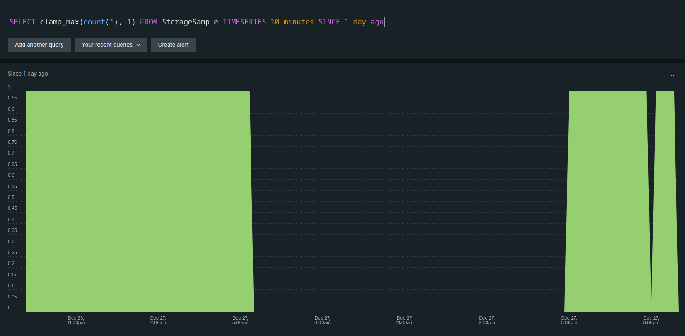

+++
author = "Oleh P"
title = "Моніториг наявності електроенергії вдома: Raspberry Pi та New Relic"
date = "2023-06-18"
description = "Коротка розповідь про те, як я моніторив наявність електроенергії вдома із RPi та New Relic під час блекаутів, спричинених обстрілами росією енергетичної інфраструктури України"
tags = [
    "newrelic",
    "raspberry pi",
    "monitoring"
]
categories = [
    "Monitoring"
]
image = "elctricity-monitoring-with-rpi-nr.jfif"
+++


Зимою 2022/23 внаслідок обстрілів росією об’єктів енергетичної інфраструктури в Україні були довготривалі блекаути.
Окрім дискомфорту у побуті, це ще й викликало незручності у роботі. Звичайно, всім вже відомо як можна мати доступ доінтеренету коли немає електрики, можна заживити ноутбук та роутер від павербанку, завести генератор, etc. Але часом простіше просто перейти працювати до друга на сусідню вулицю, якому пощастило бути підключеному до лінії, якою живляться об’єкти критичної інфраструктури. Або ж переїхати в офіс чи коворкінг. 

Але як би не було зручно у друга/офісі/коворкінгу/кафе, працювати все ж зручніше із свого улюбленого крісла із дому із місця яке ти почав облаштовувати ще із початком ковідних обмежень. Але як знати, що удома вже відновили живлення?

Тут у мені у нагоді стала Raspberry Pi 3b, яку я придбав кілька років щоб хостити Home Assistant, і яка успішно лежала ці кілька років без діла(за винятком хостингу невеликих пет-проектів час від часу). Тож виникла ідея моніторити її онлайн статус. Для цього вирішив використати New Relic - одну із найпотужніших хмарних observability платформ. Яка, крім всього, має чудовий безкоштовний план.


Отже, щоб моніторити Raspberry Pi, для початку потрібно створити акаунт у New Relic та встановити Infrastructure Agent.

## Як встановити New Relic Infrastructure Agent
Щоб інсталювати NR Infrastructure Agent заходимо на RPi через ssh.

Інсталяцію та налаштування будемо проводити за інструкцією із https://docs.newrelic.com/docs/infrastructure/install-infrastructure-agent/linux-installation/tarball-assisted-install-infrastructure-agent-linux/

1. Переходимо https://download.newrelic.com/infrastructure_agent/binaries/linux/ і завантажуємо версію, яка підходить для нашої архітектури (ARM у моєму випадку)
    
```bash
sudo curl https://download.newrelic.com/infrastructure_agent/binaries/linux/arm/newrelic-infra_linux_1.34.0_arm.tar.gz \
--output newrelic-infra_linux_1.34.0_arm.tar.gz
```
    
2. Розархівовуємо
    
```bash
tar -xf newrelic-infra_linux_1.34.0_arm.tar.gz
```
    
3. Додати [API ключ](https://docs.newrelic.com/docs/apis/intro-apis/new-relic-api-keys/) у файл `~/newrelic-infra/config_defaults.sh`
4. Запустити із правами адміністратора
    
```bash
sudo ~/newrelic-infra/installer.sh
```
    
5. Перевірити чи працює агент
    
```bash
sudo systemctl status newrelic-infra
``` 

Тепер New Relic Infra Agent збирає дані про системних ресурси і процеси хоста.

Після цього дані що моніторяться можна побачити у NR. Наприклад, щоб подивитися статистику використання CPU можна виконати такий NRQL запит:

```sql
SELECT average(cpuSystemPercent), average(cpuUserPercent), average(cpuIdlePercent), average(cpuIOWaitPercent) 
FROM SystemSample 
WHERE operatingSystem = 'linux' SINCE 1 hour ago TIMESERIES
```


## Як налаштувати повідомлення про ввімкнення/віддімкнення елетроенергії

Якщо в домі є живлення та інтернет, New Relic отримує інформацію від Raspberry Pi. Якщо дані не надходять - значить, у нас відсутня електроенергія. Давайте, налаштуємо сповіщення:

### Для початку, потрібно створити полісі

1. Перейти в **Alerts&AI → Alert conditions (Policies) → New Alert Policy**
2. Дати назву і обрати спосіб створення інцидентів - **One issue per incident**.
3. Далі **Create policy without notifications**

### Створюємо алерт
1. Додати умови для створення інцидентів: **Create a condition**
2. Обрати тип - **Infrastructure** і перейти за посиланням нижче


    
3. Відкриється сторінка із налаштуваннями алертів у розділі Infrastructure. 
    
    Ввести назву алерту і опціонально опис.
    
    - **Choose an alert type → Host not Reporting**
    - **Narrow down hosts** - вибрати хост який моніториться
    - **Define threshold -** 10
    - **Violation time limit** - 72

    Після всіх налаштувань - **Create**


### Останній крок - створюємо воркфлов

1. Перейти **Alerts&AI → Alert conditions (Policies) → Workflows → Add a workflow**
2. Додати назву
3. Вибрати Policy для якої налаштовуємо воркфлов
4. Додати канал у який приходитимуть повідомлення - **Email**
5. Вибрати емеіл на який приходитимуть повідомлення
    
    Тема листа:
    
 ```
Electricity is{{#if closedAt}} back. Blackout duration: {{issueDurationText}} {{else}} off {{/if}}
 ```

6. Щоб переконатися що все працює - **Send test notification**.
7. Я ще додав собі **Mobile Push,** щоб бачити повідомлення на мобільному.
8. Після всіх налаштувань воркфлов виглядає так:


    
9. **Activate workflow** щоб зберегти всі зміни та активувати воркфлов


_New Relic постійно працює над оновленнями, тож якщо у вас є труднощі із налаштуванням, або відрізняється інтерфейс від наведених мною скріншотів, ознайомтеся із [офіційною документацією](https://docs.newrelic.com/docs/alerts-applied-intelligence/new-relic-alerts/)_


## Результат

- Повідомлення, коли відсутня електроенергія


    
- Коли відновлюють постачання електроенергії


    
- Можна зробити окремий графік щоб відслідковувати наявність електрики вдома


    


## Недоліки рішення

1. False Positive Alert: відсутній інтернет від провайдера, але електрика в домі є. Не пригадую, щоб мені траплялася таки ситуація. Але, навіть, якщо і так -  інтернету у домі немає, а отже, працювати немає можливості
2. False Negative Alert: електрики від постачальника немає, але працює генератор чи зарядна станція і є інтернет з’єднання. Тут алерт ніяк не вплине на наші робочі процеси, так як можна припустити що нам вже відомо про проблему раз ми запустили генератор/підключили зарядну станцію(звичайно, це не правдиво у випадку встановленої системи АВР). І треба щоб плата не була заживленою від резервного джерела.


*Зображення обгортки згенеровано з допомогою Microsoft Bing Image Creator*
