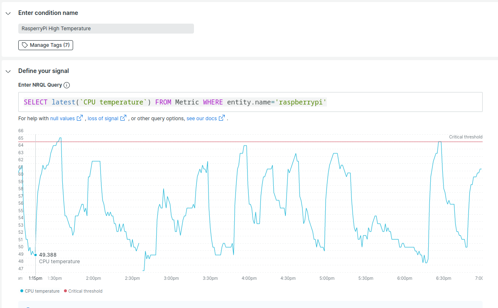

+++
author = "Oleh P"
title = "Raspberry Pi Temperature monitoring with New Relic"
date = "2023-06-20"
description = "In this article, I will show you how I monitor my Raspberry Pi 3b CPU temperature with New Relic."
tags = [
    "newrelic",
    "raspberry pi",
    "monitoring"
]
categories = [
    "Monitoring"
]
draft = false
image = "rpi-temp-featered.jfif"
+++

In this article, I will show you how I monitor my Raspberry Pi 3b CPU temperature with New Relic.

I don’t use any active or passive cooling system. The board is used mainly to run scripts at scheduled times through cron.

1. Register a free account at https://newrelic.com/
2. Create an API key for data ingestion. You can use the key that was already created for you by New Relic, but I prefer to have separate keys for each type of activity
    - Go to the [API management page](https://one.newrelic.com/api-keys) (from the account dropdown, click API keys)
    - Click **Create key.** Key Type: select **Ingest License**
    - Add description(optional)
    - Save

      

3. SSH to your Pi board
4. Create environmental variable
```bash
sudo vim /etc/profile
export NEWRELIC_METRICS_API=your_key
```
    
5. cd to your preferred folder and create a python file `cputemp.py` with the following code:
    
 ```python
#!/usr/bin/python3
    
import requests
import time
import os
    
from gpiozero import CPUTemperature

metric_endpoint = 'https://metric-api.eu.newrelic.com/metric/v1'

headers = {
    "Api-Key": os.getenv('NEWRELIC_METRICS_API'),
    "Content-Type": "application/json",
}

cpu = CPUTemperature()

metric = [{
        "metrics":[{
           "name":"CPU temperature",
           "type":"gauge",
           "value":cpu.temperature,
           "timestamp":time.time(),
           "attributes":{
           "entityName": "raspberrypi"}
           }]
    }]

r = requests.post(metric_endpoint, json=metric, headers=headers)
```

The endpoint address could be `metric-api.newrelic.com` or `metric-api.eu.newrelic.com` it depends on your configuration.
    
More details here: https://docs.newrelic.com/docs/data-apis/ingest-apis/metric-api/report-metrics-metric-api/
    
6. Give execute permission to the script
    
```bash
chmod a+x cputemp.py
```
    
7. Setup cron job. Type `crontab -e` and add following to the end of the file:
    
```bash
# Send CPU Temperature to New Relic
* * * * * /usr/bin/python3 /home/dreamer/projects/cputemp/cputemp.py
```

Exit and save the changes. The script will run and send temperature data to New Relic Metric API Endpoint every minute.

Follow the tutorial if you need help with cron configuration: [Crontab – Quick Reference](https://www.adminschoice.com/crontab-quick-reference)
    
8. Let’s check our data in New Relic. Go to **Query your data → Query Builder**  and run following query:
    
```sql
SELECT latest(`CPU temperature`) FROM Metric WHERE entity.name='raspberrypi' TIMESERIES
```
    

    
9. Now let’s configure the alert so we can have a notification when the board is overheated. Go to **Alerts & AI → Alert Conditions(Policies) →New alert Policy****. Add policy name and select **Create policy without notifications**(We will configure our notifications in a few moments)
10. On a policy page click **Create a condition**. Select **NRQL** and click **Next.**
11. Enter NRQL Query:
    
```sql
SELECT latest(`CPU temperature`) FROM Metric WHERE entity.name='raspberrypi'
```


    
Set condition threshold:
    

    
Alert will be triggered when CPU temperature will have a value above 65 for at least 5 minutes.
    
Save condition.
    
12. Now got to **Alerts&AI → Workflows → Add a workflow**.
13. Add a unique name for the workflow and pick the policy created on a previous step from the **Filter data** section.
14. Add the email address to which you want to receive messages. 
    
    Workflow configuration page now looks like this:
    

    
15. Click **Test workflow.** If everything is set up correctly, a letter will be sent to the mail address
    


*Featured image of this page was generated using Microsoft Bing Image Creator*
