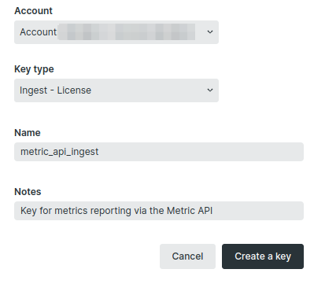
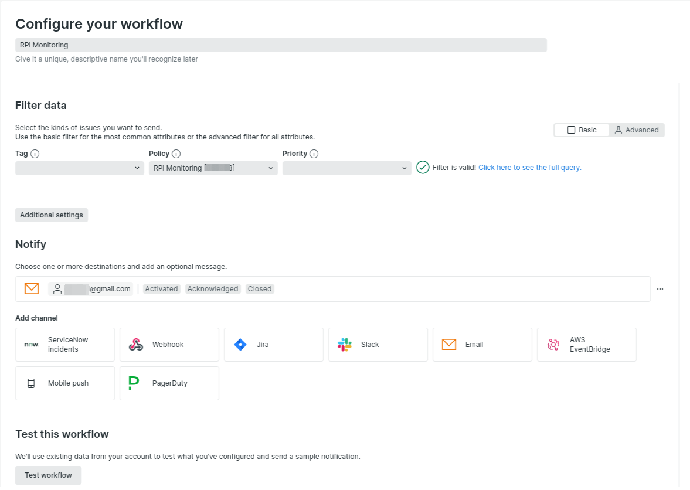
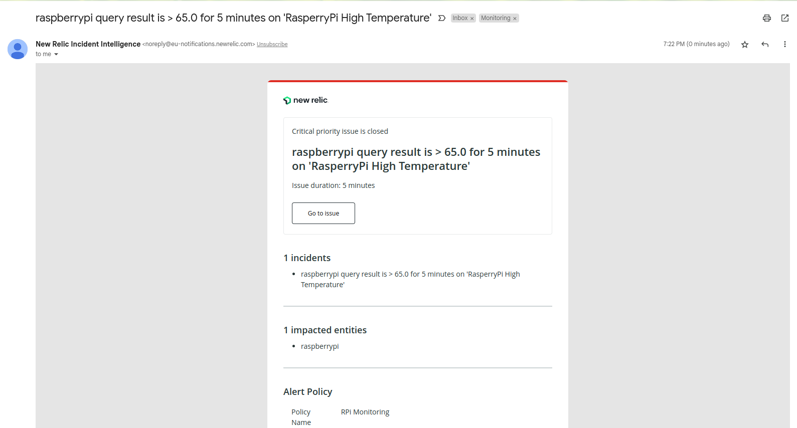

+++
author = "Oleh P"
title = "Моніторинг температури Raspberry Pi із New Relic"
date = "2023-06-20"
description = "У цій статті я розповім, як відстежую температуру процесора Raspberry Pi 3b за допомогою New Relic"
tags = [
    "newrelic",
    "raspberry pi",
    "monitoring"
]
categories = [
    "Monitoring"
]
image = "rpi-temp-featered.jfif"
+++


Я не використовую жодної активної чи пасивної системи охолодження. Плата використовується в основному для запуску скриптів за розкладом через cron.

1. Зареєструйте безкоштовний обліковий запис на https://newrelic.com/
2. Створіть ключ API для отримання даних. Ви можете використовувати ключ, який вже був створений для вас New Relic, але я вважаю за краще мати окремі ключі для кожного типу активності
    - Перейдіть на сторінку [API management page](https://one.newrelic.com/api-keys) (from the account dropdown, click API keys)
    - Натисніть  **Create key.** Тип ключа: виберіть **Ingest License**
    - Додайте опис (необов'язково)
    - Save

      

3. SSH до вашої плати
4. Створіть змінну середовища
```bash
sudo vim /etc/profile
export NEWRELIC_METRICS_API=your_key
```
    
5. Перейдіть до потрібної папки і створіть python-файл `cputemp.py` з наступним кодом:
    
 ```python
#!/usr/bin/python3
    
import requests
import time
import os
    
from gpiozero import CPUTemperature

metric_endpoint = 'https://metric-api.eu.newrelic.com/metric/v1'

headers = {
    "Api-Key": os.getenv('NEWRELIC_METRICS_API'),
    "Content-Type": "application/json",
}

cpu = CPUTemperature()

metric = [{
        "metrics":[{
           "name":"CPU temperature",
           "type":"gauge",
           "value":cpu.temperature,
           "timestamp":time.time(),
           "attributes":{
           "entityName": "raspberrypi"}
           }]
    }]

r = requests.post(metric_endpoint, json=metric, headers=headers)
```

`metric_endpoint` може бути `metric-api.newrelic.com` або `metric-api.eu.newrelic.com`, це залежить від вашої конфігурації.
    
Більш детальна інформація тут: https://docs.newrelic.com/docs/data-apis/ingest-apis/metric-api/report-metrics-metric-api/
    
6. Дайте дозвіл на виконання скрипту
    
```bash
chmod a+x cputemp.py
```
    
7. Налаштуйте задачу cron. Введіть `crontab -e` і додайте в кінець файлу наступне:

```bash
# Send CPU Temperature to New Relic
* * * * * /usr/bin/python3 /home/dreamer/projects/cputemp/cputemp.py
```

Вийдіть і збережіть зміни. Скрипт буде запускатися і щохвилини надсилати дані про температуру до New Relic Metric API Endpoint.

Якщо вам потрібна допомога з налаштуванням cron, скористайтеся підручником: [Crontab - Короткий довідник] (https://www.adminschoice.com/crontab-quick-reference)
    
8. Перевіримо наші дані в New Relic. Перейдіть до **Query your data → Query Builder** і виконайте наступний запит:
    
```sql
SELECT latest(`CPU temperature`) FROM Metric WHERE entity.name='raspberrypi' TIMESERIES
```
    

    
9. Тепер давайте налаштуємо сповіщення, щоб отримувати повідомлення, коли плата перегрівається. Перейдіть до **Alerts & AI → Alert Conditions(Policies) →New alert Policy****. Add policy name and select **Create policy without notifications**(We will configure our notifications in a few moments)
10. На сторінці політики натисніть **Create a condition**. Виберіть  **NRQL** і натисніть **Next.**
11. Введіть NRQL запит:
    
```sql
SELECT latest(`CPU temperature`) FROM Metric WHERE entity.name='raspberrypi'
```


    
Встановіть поріг:
    

    
Сповіщення спрацює, коли температура процесора буде мати значення вище 65 протягом щонайменше 5 хвилин.
    
Зберегти умову.
    
12. Тепер перйдіть до **Alerts&AI → Workflows → Add a workflow**.
13. Додайте унікальну назву для робочого процесу та виберіть політику, створену на попередньому кроці, у розділі **Filter data**.
14. Додайте адресу електронної пошти, на яку ви хочете отримувати повідомлення. 
    
    Сторінка налаштування сценарію тепер має такий вигляд:
    

    
15. Натисніть **Test workflow.** Якщо все налаштовано правильно, на поштову адресу буде надіслано лист:
    



*Featured image of this page was generated using Microsoft Bing Image Creator*
